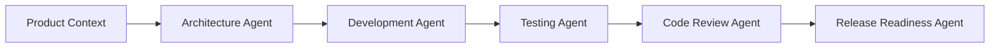

# Agents

The `agents/` folder defines practical AI agent behaviors for architecture governance, development planning, implementation guidance, code review, testing, and release readiness.

Agents define responsibility and decision behavior. Prompts define repeatable workflows that can be copied into ChatGPT, Codex, Cursor, Claude, Windsurf, or future AI tools.

Dumbledore acts as the governance source. Agents should use Dumbledore principles, templates, checklists, playbooks, patterns, and anti-patterns as context. Generated HLDs, LLDs, ADRs, implementation plans, reviews, test plans, and release reports belong in project repositories, not in Dumbledore.

## Operating Model

## How To Use Agents

| Step | Agent | Output |
| --- | --- | --- |
| Understand product and constraints | Architecture Governance Agent | System context, HLD, LLD, ADRs, risk register. |
| Convert architecture into work | Development Agent | Sequenced implementation plan and vertical slices. |
| Validate quality strategy | Testing Agent | Test matrix, failure scenarios, CI recommendations. |
| Review implementation | Code Review Agent | Blockers, major issues, test gaps, patch plan. |
| Decide release readiness | Release Readiness Agent | Go/no-go report, rollback plan, monitoring checklist. |

## Usage Rules

- Provide project context before asking an agent for decisions.
- Ask the agent to cite the Dumbledore documents it used.
- Keep outputs structured, reviewable, and stored in the project repo.
- Prefer small, practical workflows over over-engineered agent chains.
- Treat AI output as a draft until reviewed by an accountable engineer.

