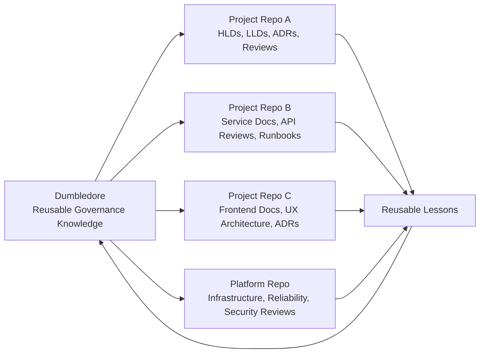
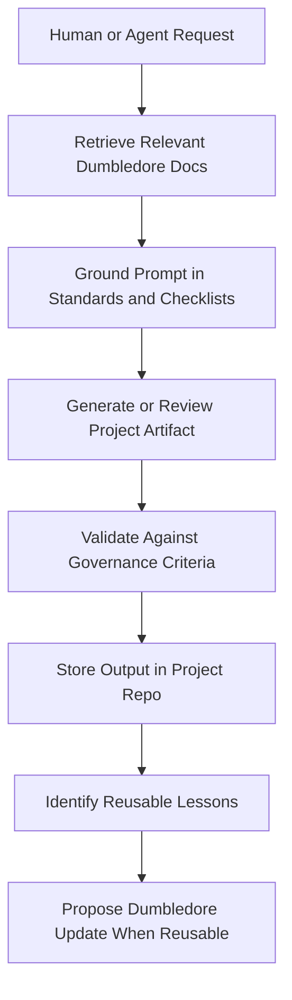

# Dumbledore Usage Strategy

## 1. Purpose of Dumbledore

Dumbledore is a reusable architecture governance knowledge base. It exists to make architecture guidance durable, reviewable, repeatable, and useful to both human teams and AI-assisted engineering workflows.

Dumbledore acts as:

| Role | Meaning |
| --- | --- |
| Architecture governance memory | Preserves reusable principles, patterns, review criteria, and lessons learned across products. |
| Reusable architecture standards repository | Defines practical standards that project teams can reference, copy, and adapt. |
| Engineering review framework | Provides checklists and review processes for architecture, APIs, security, observability, infrastructure, scale, and production readiness. |
| Architecture decision support system | Helps teams compare options, make trade-offs explicit, and avoid repeating known failure modes. |
| AI-assisted governance knowledge base | Gives AI agents structured context for generating, reviewing, and improving architecture artifacts. |
| Reusable playbook system | Captures common architecture paths such as SaaS platforms, modular monoliths, microservices evolution, frontend platforms, event-driven systems, and AI agent platforms. |
| Long-term engineering operating model | Defines how architecture governance is practiced, improved, and applied over time. |

Dumbledore is intentionally:

- Organization-agnostic.
- Project-agnostic.
- Reusable across products and platforms.
- Technology-aware but not technology-dogmatic.
- Designed to evolve continuously from real engineering experience.

Dumbledore should help teams move faster by making good architecture review easier, not by turning governance into heavyweight process.

## 2. What Dumbledore Is NOT

Dumbledore is not a project delivery repository. It does not own product requirements, implementation details, sprint artifacts, or runtime systems.

| Dumbledore is NOT | Where that belongs |
| --- | --- |
| A project repository | The owning product or service repository. |
| A feature delivery repo | The application, service, frontend, backend, or platform repo implementing the feature. |
| A microservice repo | The microservice's own code repository. |
| A sprint documentation dump | The team's delivery tracker, project workspace, or planning system. |
| A business requirement repository | Product management, planning, or requirements tooling. |
| A runtime AI agent implementation | The agent platform, automation repo, or tool execution runtime. |

Project-specific architecture belongs in project repositories. Product ADRs belong in project repositories. Implementation details belong in implementation repositories. Dumbledore stores reusable governance knowledge only.

### Anti-Pattern Examples

- Adding a product-specific HLD to Dumbledore because the project does not yet have a docs folder.
- Storing customer-specific constraints, environment names, secrets, endpoints, or production incident data in Dumbledore.
- Changing a reusable checklist to justify one project's exception instead of documenting that exception in the project ADR.
- Treating a sample architecture as an approved implementation blueprint without validating domain, scale, security, cost, and team ownership.
- Using Dumbledore as an issue tracker, sprint archive, or requirements backlog.
- Placing AI agent runtime prompts, tool credentials, or automation code in Dumbledore.

## 3. Daily Usage Model

Dumbledore should be used as a reference and review system during normal engineering work. It should be consulted before design decisions become expensive to reverse.

| Activity | How Dumbledore Should Be Used | Expected Output |
| --- | --- | --- |
| Architecture discussions | Use principles, playbooks, patterns, and anti-patterns to frame options. | Clear options, assumptions, trade-offs, and risks. |
| HLD creation | Start from the HLD template and validate against architecture, security, observability, and scalability guidance. | Project-specific HLD stored in the project repo. |
| LLD creation | Start from the LLD template and validate APIs, data model, failure modes, testability, and operational behavior. | Project-specific LLD stored in the project repo. |
| API reviews | Apply the API design checklist and relevant auth, observability, and scalability guidance. | Review findings with required changes and owners. |
| Scalability reviews | Use scalability principles, scaling anti-patterns, caching patterns, async patterns, and production readiness criteria. | Current limits, expected growth path, and scale triggers. |
| Production readiness reviews | Apply production readiness, observability, security, infrastructure, and incident readiness checklists. | Go-live risks, blockers, and operational actions. |
| Infrastructure planning | Use infrastructure planning, cost-awareness, security, reliability, and operational excellence guidance. | Infrastructure proposal with explicit constraints and trade-offs. |
| Security reviews | Apply secure-by-default principles and the security review checklist early in design. | Security risks, mitigations, owners, and unresolved exceptions. |
| AI system design | Use AI system principles and AI agent platform playbooks to review retrieval, tools, permissions, evaluations, and auditability. | Agent design with governance controls and evaluation strategy. |
| Engineering onboarding | Use Dumbledore as the architecture governance baseline for how decisions are reviewed and documented. | Shared expectations for architecture quality and review behavior. |

### Role-Based Workflows

| Role | Expected Usage |
| --- | --- |
| Engineering Managers | Use Dumbledore to set review expectations, ensure teams document decisions, and avoid repeated architecture mistakes across delivery streams. |
| Architects | Maintain reusable standards, guide project teams through trade-offs, review governance changes, and identify patterns worth standardizing. |
| Principal Engineers | Use Dumbledore to drive design quality, coach teams, challenge weak assumptions, and feed repeated lessons back into reusable guidance. |
| Technical Leads | Apply templates and checklists in project repos, create project ADRs, and ensure implementation plans reflect agreed architecture decisions. |
| AI coding assistants | Retrieve relevant Dumbledore documents as context, generate project-specific artifacts in project repos, cite applied guidance, and keep assumptions explicit. |

### Daily Review Checklist

- [ ] Is this decision reusable governance or project-specific documentation?
- [ ] Has the team started from the appropriate template or checklist?
- [ ] Are assumptions, constraints, alternatives, and trade-offs explicit?
- [ ] Are security, observability, operations, cost, and maintainability addressed?
- [ ] Is the output stored in the correct repository?
- [ ] Is any reusable learning worth feeding back into Dumbledore?

## 4. Relationship With Project Repositories

Project repositories consume Dumbledore. They do not outsource their architecture ownership to it.

Project repos should:

- Use Dumbledore templates as starting points for HLDs, LLDs, ADRs, RFCs, and incident reviews.
- Copy governance checklists when review evidence must live beside the implementation.
- Reference Dumbledore standards from project documentation.
- Adapt patterns to the project's domain, scale, constraints, and team topology.
- Create project-specific ADRs separately in the project repo.
- Feed reusable learnings back into Dumbledore when they apply beyond one product.

Project repos should not:

- Store product ADRs in Dumbledore.
- Modify Dumbledore to hide project-specific risk.
- Treat Dumbledore examples as implementation approvals.
- Depend on Dumbledore as a runtime dependency.

### Recommended Repo Interaction Model

### Interaction Rules

| Direction | Rule |
| --- | --- |
| Dumbledore to project repos | Reference, copy, and adapt reusable guidance. |
| Project repos to Dumbledore | Contribute only reusable patterns, anti-patterns, review improvements, and operating lessons. |
| Project ADRs | Stay in project repos. |
| Dumbledore ADRs | Capture decisions about Dumbledore itself. |
| Exceptions | Document in the project repo with rationale, owner, review date, and risk acceptance. |

## 5. AI-Assisted Workflow Strategy

Dumbledore should be used as architecture context for AI systems such as ChatGPT, Codex, Cursor, Claude, Windsurf, and future AI agents. AI tools should treat Dumbledore as a governance retrieval source, not as a substitute for engineering accountability.

AI workflows should use Dumbledore as:

- Architecture context for generating HLDs, LLDs, ADRs, RFCs, and review notes.
- A governance retrieval source for standards, checklists, principles, playbooks, patterns, and anti-patterns.
- Reusable architecture memory that reduces repeated explanation across prompts and projects.
- A review framework for critiquing designs, code changes, APIs, infrastructure proposals, and operational readiness.
- A prompt grounding source that keeps AI outputs aligned with governance expectations.

### AI Consumption Workflow

### AI Usage Requirements

- [ ] Retrieve only relevant Dumbledore documents for the task.
- [ ] State which principles, templates, checklists, playbooks, or patterns were used.
- [ ] Separate facts, assumptions, recommendations, and open questions.
- [ ] Keep project-specific artifacts in the project repo.
- [ ] Include trade-offs, alternatives, risks, and review triggers.
- [ ] Avoid inventing organization-specific policy that is not present in the repository.
- [ ] Ask for human review before treating governance-sensitive output as accepted.

### Future AI Governance Capabilities

Dumbledore should be structured so it can support future capabilities without rewriting the operating model:

| Capability | Practical Meaning |
| --- | --- |
| RAG | Retrieve the most relevant governance documents for architecture generation and review. |
| MCP integration | Expose Dumbledore documents and workflows to AI tools through controlled interfaces. |
| Automated governance | Run repeatable checks against architecture documents, pull requests, and readiness evidence. |
| Architecture fitness functions | Convert selected review expectations into testable signals where practical. |
| Policy-as-code | Express enforceable governance rules for security, infrastructure, data, and operational readiness. |

Automation should assist governance. It should not remove accountable engineering review.

## 6. Governance Evolution Strategy

Dumbledore evolves through deliberate, reviewable change. New guidance should come from repeated engineering need, real incidents, architecture review findings, operational learning, or strategic platform evolution.

### Evolution Sources

- Quarterly governance reviews.
- ADR-driven evolution.
- New reusable architecture patterns.
- Refinement of known anti-patterns.
- Operational learnings from production systems.
- Postmortem learnings that generalize beyond one project.
- Scaling lessons from product growth.
- AI workflow improvements and prompt-grounding lessons.

### Quarterly Governance Review

Each quarterly review should evaluate:

- [ ] Which guidance was used frequently?
- [ ] Which checklists missed material risks?
- [ ] Which documents caused confusion or inconsistent interpretation?
- [ ] Which anti-patterns appeared repeatedly in reviews?
- [ ] Which patterns are now mature enough to standardize?
- [ ] Which guidance is stale, duplicated, or too project-specific?
- [ ] Which AI workflows produced useful governance outcomes?

### Deprecation and Versioning Rules

| Rule | Requirement |
| --- | --- |
| Deprecate explicitly | Mark outdated guidance as deprecated before removing it when downstream users may still reference it. |
| Explain replacement guidance | Deprecated documents must point to the preferred replacement or explain why no replacement exists. |
| Use ADRs for policy changes | Material governance changes require an ADR under `decisions/adr/`. |
| Keep history reviewable | Avoid silent rewrites of major decision criteria. Preserve rationale in commits or ADRs. |
| Prefer refinement over accumulation | Improve existing documents before adding overlapping new documents. |
| Avoid governance sprawl | Do not add a new checklist, pattern, or playbook unless ownership, audience, and reuse case are clear. |

## 7. Contribution Guidelines

Contributions must improve reusable governance quality. They should be clear enough for humans to apply and structured enough for AI agents to retrieve and interpret.

### Document Quality Standards

- Write in direct, operational language.
- Define scope, audience, and expected use.
- Separate principles, guidance, trade-offs, checklists, and examples.
- Include risks and anti-patterns where relevant.
- Avoid vendor-specific advice unless framed as a trade-off example.
- Avoid vague statements that cannot guide a review decision.

### Trade-Off Documentation Requirements

Any material recommendation should explain:

- What problem it solves.
- When it fits.
- When it does not fit.
- Operational impact.
- Security impact.
- Cost impact.
- Maintainability impact.
- Review triggers that would cause the decision to be revisited.

### Markdown and Metadata Expectations

Every reusable document should include YAML frontmatter with:

- `document_type`
- `scope`
- `audience`
- `status`
- `review_cycle`
- `tags`
- `related_documents`

Markdown should use:

- Clear heading hierarchy.
- Tables for comparisons and ownership models.
- Checklists for repeatable review steps.
- Mermaid diagrams where flow, ownership, or relationships need to be explicit.
- Relative links for related repository documents.

### Review Expectations

Before merging governance changes:

- [ ] Confirm the content is reusable beyond one project.
- [ ] Confirm the document belongs in Dumbledore rather than a project repo.
- [ ] Check for overlap with existing principles, templates, checklists, patterns, playbooks, and anti-patterns.
- [ ] Validate that trade-offs and anti-patterns are explicit.
- [ ] Confirm metadata and links are correct.
- [ ] Ensure AI agents can retrieve and apply the document without hidden organizational assumptions.
- [ ] Require architecture-owner review for policy or checklist changes.

## 8. Recommended Governance Principles

Dumbledore should reinforce the following operational principles:

| Principle | Governance Expectation |
| --- | --- |
| Simplicity first | Prefer the simplest architecture that satisfies current constraints and leaves a credible path to evolve. |
| Maintainability over hype | Do not adopt architectural complexity because it is fashionable. Justify it through concrete constraints. |
| Operational excellence | Design for deployment, monitoring, incident response, recovery, and ownership from the start. |
| Observability by default | Logs, metrics, traces, dashboards, and alerts are part of the system design, not afterthoughts. |
| Secure-by-default systems | Security controls, access boundaries, data protection, and auditability must be reviewed early. |
| Modular evolution | Keep boundaries clear and evolve distribution only when domain, scale, or team topology requires it. |
| Cost-awareness | Treat cost as an architecture constraint, especially for data, infrastructure, AI, and high-scale workloads. |
| Developer productivity | Architecture should reduce cognitive load and enable teams to deliver safely. |
| Explicit trade-off reasoning | Decisions must show alternatives, consequences, and review triggers. |

## 9. Future Vision

Dumbledore should evolve into an AI-native architecture governance operating system: a durable knowledge base that helps teams make better decisions, review designs consistently, and learn from engineering outcomes over time.

The long-term vision includes:

- AI-native architecture governance where AI agents can retrieve, apply, and critique guidance consistently.
- Reusable architecture memory that reduces repeated decision-making across teams.
- Engineering decision intelligence that connects principles, ADRs, review findings, incidents, and operational outcomes.
- Automated review systems that identify missing risks, weak assumptions, and governance gaps before implementation.
- Governance automation for repeatable checks across architecture documents, pull requests, infrastructure plans, and production readiness evidence.
- Architecture operating system evolution where Dumbledore becomes the shared foundation for how teams design, review, operate, and improve systems.

This vision should remain practical. Dumbledore should improve the quality and speed of engineering decisions without replacing accountable human judgment, project ownership, or direct operational responsibility.
