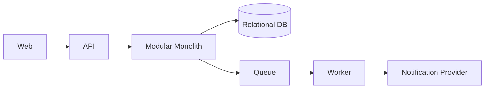

# Sample HLD: Task Collaboration Platform

## Purpose

Demonstrate the expected shape and depth of a reusable high-level architecture document. This is illustrative, not a project decision.

## Recommended Sections

- Goals and non-goals.
- MVP architecture.
- Scale-stage architecture.
- System context and component diagrams.
- Trade-offs, risks, and open questions.

## Goals

- Support teams creating, assigning, and tracking tasks.
- Keep MVP architecture simple and operable.
- Define a credible path to scale without starting distributed.

## MVP Architecture

A modular monolith exposes web and API interfaces. Modules include identity, workspace, task, notification, and audit. A single relational database stores module-owned tables. Background workers handle notifications and reminders.

## Scale-Stage Architecture

If notification volume, workflow automation, or tenant isolation pressure grows, extract those modules behind explicit contracts. Keep task ownership in the core until domain boundaries and load justify extraction.

## Diagram

## Trade-Offs

- Simpler operations now, with disciplined module boundaries required to avoid future extraction pain.
- Shared database improves speed but requires ownership rules.
## Anti-Patterns

- Treating this document as a technology mandate instead of a decision aid.
- Copying examples without validating domain, team, scale, and operating constraints.
- Skipping explicit trade-offs because one option feels familiar.
- Optimizing for theoretical scale before proving product and usage patterns.

## Review Questions

- Does this guidance favor the simplest architecture that can satisfy current constraints?
- Are MVP and scale-stage choices separated clearly?
- Are trade-offs, risks, and alternatives explicit?
- Can a human reviewer and an AI agent apply this guidance without project-specific assumptions?
- Are security, operability, cost, and maintainability considered before novelty?
