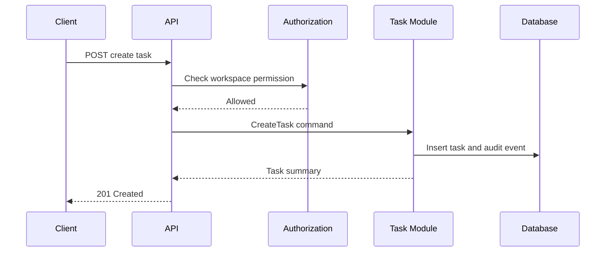

# Sample LLD: Create Task Flow

## Purpose

Demonstrate implementation-level detail for one workflow inside a larger architecture.

## Recommended Sections

- Scope and linked HLD.
- API contract.
- Validations and invariants.
- Sequence diagram.
- Test plan and rollout notes.

## Scope

Create a task inside an existing workspace.

## API Contract

`POST /workspaces/{workspace_id}/tasks` creates a task when the actor has contributor permission.

## Validations

- Title is required and length-limited.
- Workspace must exist and be active.
- Actor must have permission to create tasks.
- Due date, if provided, must be valid in workspace timezone.

## Sequence

## Test Plan

- Unit tests for validation.
- Authorization tests for role matrix.
- Integration test for successful creation and audit entry.
- Idempotency test if client retry support is enabled.
## Anti-Patterns

- Treating this document as a technology mandate instead of a decision aid.
- Copying examples without validating domain, team, scale, and operating constraints.
- Skipping explicit trade-offs because one option feels familiar.
- Optimizing for theoretical scale before proving product and usage patterns.

## Review Questions

- Does this guidance favor the simplest architecture that can satisfy current constraints?
- Are MVP and scale-stage choices separated clearly?
- Are trade-offs, risks, and alternatives explicit?
- Can a human reviewer and an AI agent apply this guidance without project-specific assumptions?
- Are security, operability, cost, and maintainability considered before novelty?
