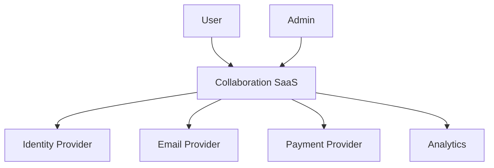

# Sample System Context

## Purpose

Show a concise system context format for architecture discussions and AI retrieval.

## Recommended Sections

- Actors and systems.
- External dependencies.
- Trust boundaries.
- Critical flows.
- Review questions.

## Context

A SaaS product lets users manage collaborative workspaces. External dependencies include identity provider, email provider, payment provider, and analytics system.

## Diagram

## Review Questions

- Which dependencies are critical path?
- What happens when each dependency fails?
- Which data crosses trust boundaries?
- Which integrations need audit trails?
## Anti-Patterns

- Treating this document as a technology mandate instead of a decision aid.
- Copying examples without validating domain, team, scale, and operating constraints.
- Skipping explicit trade-offs because one option feels familiar.
- Optimizing for theoretical scale before proving product and usage patterns.

## Review Questions

- Does this guidance favor the simplest architecture that can satisfy current constraints?
- Are MVP and scale-stage choices separated clearly?
- Are trade-offs, risks, and alternatives explicit?
- Can a human reviewer and an AI agent apply this guidance without project-specific assumptions?
- Are security, operability, cost, and maintainability considered before novelty?
