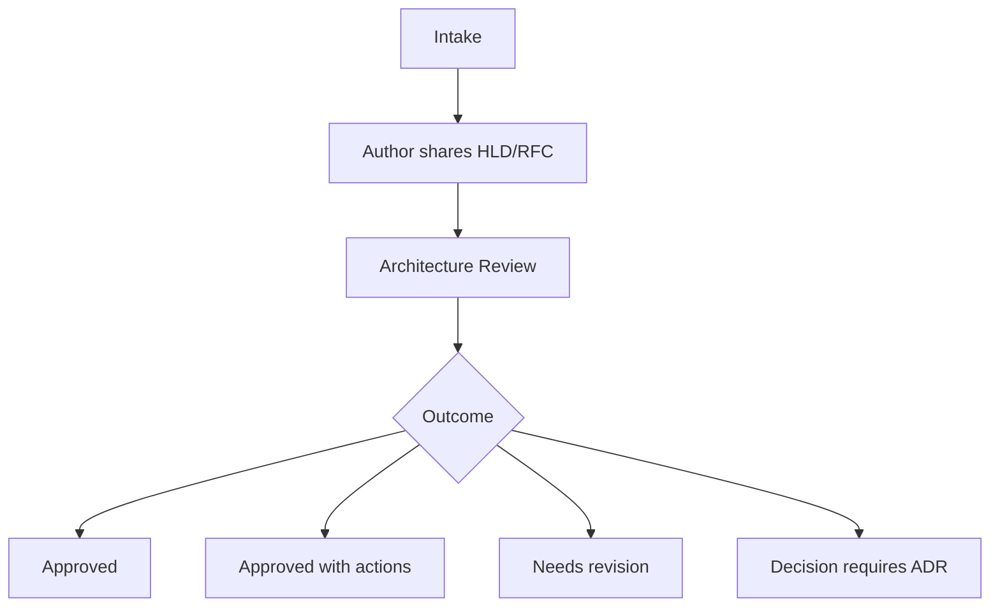

# Architecture Review Process

## Purpose

Define a lightweight process for reviewing architecture proposals before teams commit to implementation paths that are costly to change.

## Recommended Sections

- Intake criteria.
- Required inputs.
- Review roles.
- Review agenda.
- Decision outcomes.
- Follow-up tracking.

## Practical Guidance

1. Confirm business goal and constraints.
2. Review MVP architecture first.
3. Review scale-stage path second.
4. Challenge unclear ownership, hidden coupling, weak observability, and premature distribution.
5. End with one of: approved, approved with actions, needs revision, or requires ADR.

## Review Flow

## Anti-Patterns

- Treating this document as a technology mandate instead of a decision aid.
- Copying examples without validating domain, team, scale, and operating constraints.
- Skipping explicit trade-offs because one option feels familiar.
- Optimizing for theoretical scale before proving product and usage patterns.

## Review Questions

- Does this guidance favor the simplest architecture that can satisfy current constraints?
- Are MVP and scale-stage choices separated clearly?
- Are trade-offs, risks, and alternatives explicit?
- Can a human reviewer and an AI agent apply this guidance without project-specific assumptions?
- Are security, operability, cost, and maintainability considered before novelty?
