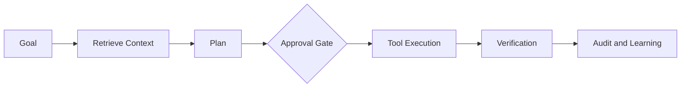

# AI Agent Platform Playbook

## Purpose

Guide architecture for AI and agentic platforms with retrieval, planning, tool execution, evaluation, permissions, and auditability.

## Practical Guidance

- Model agent authority as an access-control problem.
- Keep tools typed, scoped, observable, and reversible where possible.
- Use retrieval with source attribution and freshness controls.
- Build evaluation suites before expanding autonomy.
- Separate prompt configuration, policy enforcement, and execution services.

## Agent Lifecycle

## Anti-Patterns

- Treating this document as a technology mandate instead of a decision aid.
- Copying examples without validating domain, team, scale, and operating constraints.
- Skipping explicit trade-offs because one option feels familiar.
- Optimizing for theoretical scale before proving product and usage patterns.

## Review Questions

- Does this guidance favor the simplest architecture that can satisfy current constraints?
- Are MVP and scale-stage choices separated clearly?
- Are trade-offs, risks, and alternatives explicit?
- Can a human reviewer and an AI agent apply this guidance without project-specific assumptions?
- Are security, operability, cost, and maintainability considered before novelty?
