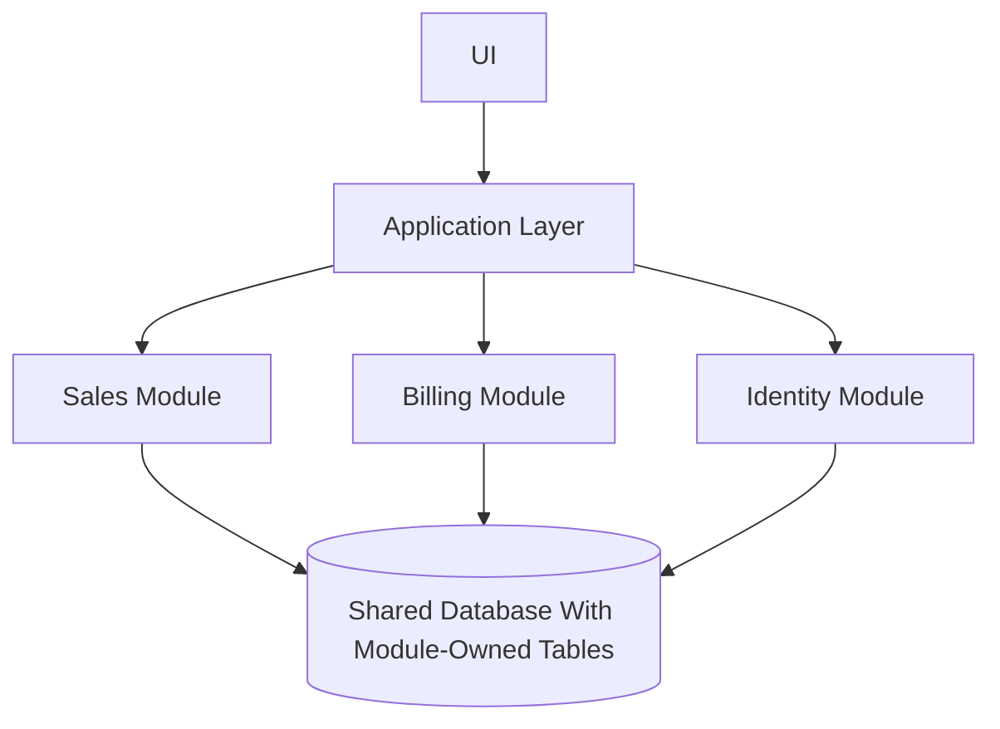

# Modular Monolith Playbook

## Purpose

Guide the design of modular monoliths as the preferred starting point for many 0-to-1 products and SaaS systems.

## Practical Guidance

- Define modules by business capability.
- Keep module APIs explicit.
- Avoid cross-module database writes unless intentionally governed.
- Use package boundaries, tests, and ownership rules to prevent erosion.
- Prepare extractable seams without paying distributed-systems cost early.

## Module Boundary Diagram

## Anti-Patterns

- Treating this document as a technology mandate instead of a decision aid.
- Copying examples without validating domain, team, scale, and operating constraints.
- Skipping explicit trade-offs because one option feels familiar.
- Optimizing for theoretical scale before proving product and usage patterns.

## Review Questions

- Does this guidance favor the simplest architecture that can satisfy current constraints?
- Are MVP and scale-stage choices separated clearly?
- Are trade-offs, risks, and alternatives explicit?
- Can a human reviewer and an AI agent apply this guidance without project-specific assumptions?
- Are security, operability, cost, and maintainability considered before novelty?
