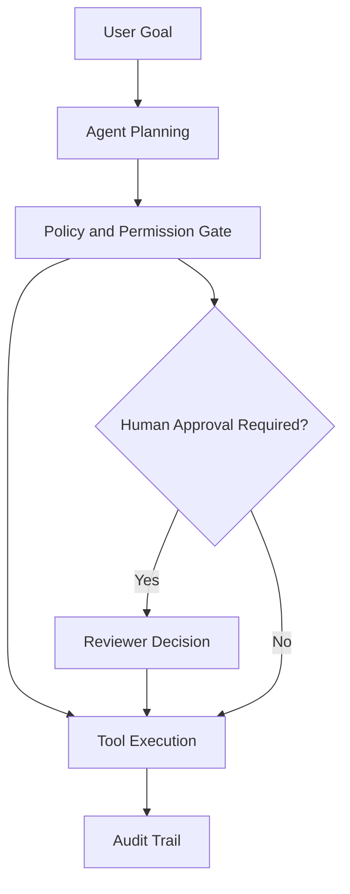

# AI System Principles

## Purpose

Provide reusable governance for AI and agentic systems where behavior is probabilistic, tool use creates side effects, and human trust matters.

## Recommended Sections

- Agent purpose and authority boundaries.
- Tool permissions and side effects.
- Human-in-loop checkpoints.
- Evaluation strategy.
- Data handling and privacy.
- Observability and auditability.
- Failure modes and rollback.

## Practical Guidance

- Give agents narrow goals, explicit tools, and bounded write access.
- Separate recommendation, planning, execution, and approval capabilities.
- Record prompts, retrieved context identifiers, tool calls, outputs, and human approvals where risk warrants auditability.
- Evaluate with scenario suites, regression cases, and adversarial examples.
- Use deterministic systems for invariants, policy enforcement, payments, identity, and permissions.

## Control Model

## Examples

- Low risk: agent drafts a design review checklist for human approval.
- Medium risk: agent opens a pull request but cannot merge it.
- High risk: agent changes production configuration only through a reviewed workflow with rollback.

## Anti-Patterns

- Treating this document as a technology mandate instead of a decision aid.
- Copying examples without validating domain, team, scale, and operating constraints.
- Skipping explicit trade-offs because one option feels familiar.
- Optimizing for theoretical scale before proving product and usage patterns.

## Review Questions

- Does this guidance favor the simplest architecture that can satisfy current constraints?
- Are MVP and scale-stage choices separated clearly?
- Are trade-offs, risks, and alternatives explicit?
- Can a human reviewer and an AI agent apply this guidance without project-specific assumptions?
- Are security, operability, cost, and maintainability considered before novelty?
