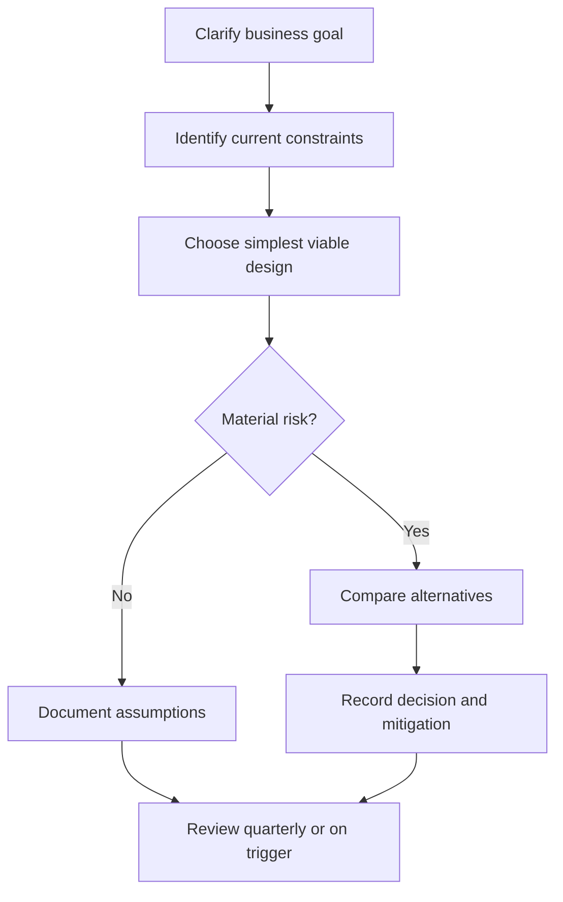

# Architecture Principles

## Purpose

Define durable rules for making architecture decisions that remain useful across product stages, domains, teams, and technology stacks.

## Recommended Sections For Architecture Documents

- Context and goals.
- Current constraints and assumptions.
- MVP architecture.
- Scale-stage architecture.
- Alternatives considered.
- Trade-offs and risks.
- Security, operations, and cost impact.
- Decision record links.

## Practical Guidance

1. Design for the next credible stage, not the most impressive future state.
2. Prefer explicit module boundaries before process, network, or team boundaries.
3. Keep data ownership clear. Shared databases across independent services are a warning sign.
4. Favor reversible decisions for MVPs and record irreversible decisions carefully.
5. Make reliability requirements measurable before introducing reliability machinery.
6. Treat integration boundaries as product contracts, not plumbing details.

## Decision Ladder

## Examples

- MVP: a modular monolith with clear domain modules and one operational datastore.
- Scale-stage: selected services extracted only after module ownership, throughput, deployment cadence, or compliance needs justify distribution.

## Anti-Patterns

- Treating this document as a technology mandate instead of a decision aid.
- Copying examples without validating domain, team, scale, and operating constraints.
- Skipping explicit trade-offs because one option feels familiar.
- Optimizing for theoretical scale before proving product and usage patterns.

## Review Questions

- Does this guidance favor the simplest architecture that can satisfy current constraints?
- Are MVP and scale-stage choices separated clearly?
- Are trade-offs, risks, and alternatives explicit?
- Can a human reviewer and an AI agent apply this guidance without project-specific assumptions?
- Are security, operability, cost, and maintainability considered before novelty?
