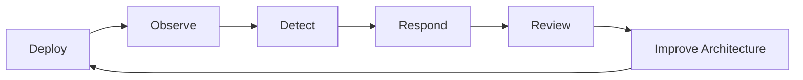

# Operational Excellence

## Purpose

Define the operating expectations every architecture should satisfy before production use.

## Recommended Sections

- Service ownership.
- SLOs and user-impacting signals.
- Monitoring and alerting.
- Runbooks.
- Incident response.
- Deployment and rollback.
- Capacity, cost, and dependency management.

## Practical Guidance

- Every critical path needs logs, metrics, traces, and a human-readable runbook.
- Alerts should represent user impact or imminent risk, not dashboard curiosity.
- Rollback must be designed before launch.
- Operational toil is acceptable temporarily only when visible and intentionally paid down.
- Cost observability belongs in architecture reviews, not just finance reviews.

## Operating Model

## Anti-Patterns

- Treating this document as a technology mandate instead of a decision aid.
- Copying examples without validating domain, team, scale, and operating constraints.
- Skipping explicit trade-offs because one option feels familiar.
- Optimizing for theoretical scale before proving product and usage patterns.

## Review Questions

- Does this guidance favor the simplest architecture that can satisfy current constraints?
- Are MVP and scale-stage choices separated clearly?
- Are trade-offs, risks, and alternatives explicit?
- Can a human reviewer and an AI agent apply this guidance without project-specific assumptions?
- Are security, operability, cost, and maintainability considered before novelty?
