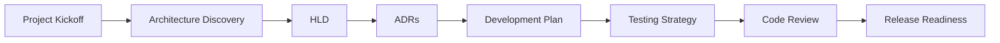

# Prompts

The `prompts/` folder contains executable reusable workflows for AI-assisted architecture, development, review, testing, and release readiness.

Prompts should be copied into ChatGPT, Codex, Cursor, Claude, Windsurf, or future AI tools when working on real projects. Adapt each prompt with project context, repo paths, constraints, and current architecture decisions. Generated outputs belong in the project repository, not in Dumbledore.

## Recommended Prompt Workflow

1. Project kickoff.
2. Architecture discovery.
3. HLD.
4. ADRs.
5. Development plan.
6. Testing strategy.
7. Code review.
8. Release readiness.

## Usage Rules

- Use Dumbledore as governance context.
- Add project context before running a prompt.
- Keep outputs structured and reviewable.
- Store project-specific outputs in the project repo.
- Ask the AI tool to separate assumptions, decisions, risks, and open questions.

