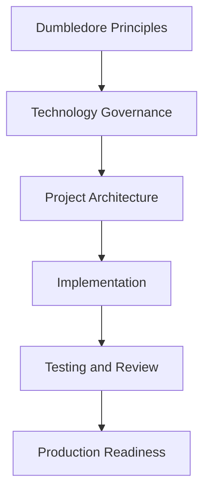

# Technology Governance Guides

## Purpose

Technology governance guides define how specific stacks should be used in real product engineering. They are architecture and delivery standards, not tutorials.

These guides define:

- Architecture standards.
- Implementation expectations.
- Testing expectations.
- Operational patterns.
- Review standards.
- Scalability guidance.
- Security considerations.
- Maintainability rules.
- Common anti-patterns.

## Governance, Not Tutorials

| This section does | This section does not |
| --- | --- |
| Defines when a technology fits. | Teach framework basics. |
| Sets implementation and review expectations. | Explain syntax. |
| Defines operational and testing standards. | Provide random snippets. |
| Helps AI assistants stay within architecture boundaries. | Store project-specific implementations. |

## How To Use These Guides

- Architects use them to evaluate technology fit and architecture trade-offs.
- Technical leads use them to define project-specific implementation standards.
- Developers use them as review and implementation guardrails.
- AI coding assistants use them as prompt context before generating code.
- Project repositories copy or reference the relevant guidance, then store project-specific decisions locally.

## Governance Flow

## Consumption Rules

- Use the guide that matches the technology in the project.
- Treat recommendations as defaults, not blind mandates.
- Document exceptions in project ADRs.
- Keep project-specific architecture, code, and decisions out of Dumbledore.
- Ask AI assistants to cite the guide used and list assumptions before implementation.

