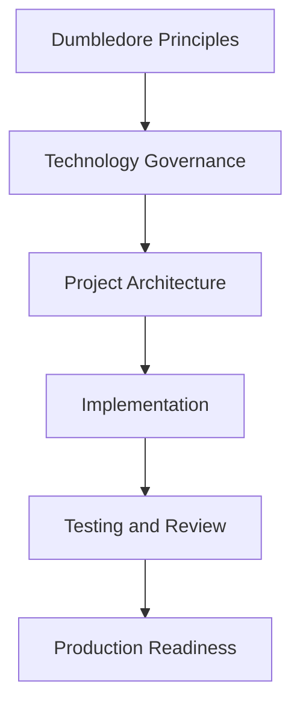

# Technology Governance Guides

## Purpose

Technology governance guides define how specific stacks should be used in real product engineering. They are architecture and delivery standards, not tutorials.

These guides define:

- Architecture standards.
- Implementation expectations.
- Testing expectations.
- Operational patterns.
- Review standards.
- Scalability guidance.
- Security considerations.
- Maintainability rules.
- Common anti-patterns.

## Governance, Not Tutorials

| This section does | This section does not |
| --- | --- |
| Defines when a technology fits. | Teach framework basics. |
| Sets implementation and review expectations. | Explain syntax. |
| Defines operational and testing standards. | Provide random snippets. |
| Helps AI assistants stay within architecture boundaries. | Store project-specific implementations. |

## How To Use These Guides

- Architects use them to evaluate technology fit and architecture trade-offs.
- Technical leads use them to define project-specific implementation standards.
- Developers use them as review and implementation guardrails.
- AI coding assistants use them as prompt context before generating code.
- Project repositories copy or reference the relevant guidance, then store project-specific decisions locally.

## Relationship With Code Review Agent

Technology guides are mandatory inputs for stack-specific code reviews. The Code Review Agent is responsible for detecting the changed stack, selecting the relevant guides, and applying them alongside Dumbledore principles, governance checklists, project HLDs, LLDs, ADRs, and PR context.

Technology guides provide stack-specific rules. `agents/code-review-agent.md` provides the review process, source resolution model, severity model, and output format. `prompts/code-review-prompts.md` executes the workflow in ChatGPT, Codex, Cursor, Claude, Windsurf, and future AI-assisted review tools.

| Technology Area | Guide | Used For |
| --- | --- | --- |
| React | `frontend/react-governance.md` | UI architecture, hooks, state, performance, accessibility. |
| Angular | `frontend/angular-governance.md` | Module boundaries, RxJS, DI, enterprise frontend patterns. |
| TypeScript | `frontend/typescript-governance.md` | Typing, DTOs, contracts, unsafe casts. |
| Java | `backend/java-governance.md` | Backend architecture, transactions, service boundaries. |
| Node.js | `backend/nodejs-governance.md` | BFF/API services, async safety, validation. |
| Go | `backend/golang-governance.md` | Concurrency, services, workers. |
| Python | `backend/python-governance.md` | FastAPI, AI services, scripting vs production. |
| REST | `api/rest-governance.md` | Resource APIs, error contracts, compatibility. |
| GraphQL | `api/graphql-governance.md` | Schema, resolvers, query complexity. |
| Middleware | `platform/middleware-governance.md` | Orchestration, integration, retries, idempotency. |

## Governance Flow

## Consumption Rules

- Use the guide that matches the technology in the project.
- Treat recommendations as defaults, not blind mandates.
- Document exceptions in project ADRs.
- Keep project-specific architecture, code, and decisions out of Dumbledore.
- Ask AI assistants to cite the guide used and list assumptions before implementation.
