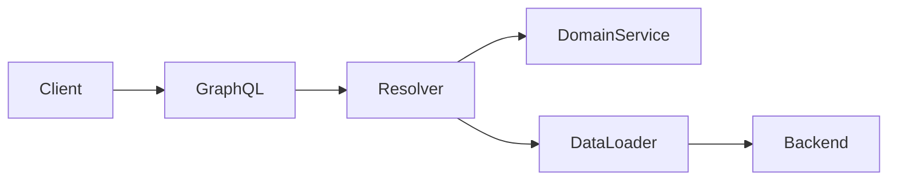

# GraphQL Governance

# Purpose

Define governance for GraphQL APIs with clear justification, schema ownership, resolver boundaries, performance controls, authorization, observability, and evolution discipline.

# When To Use This Technology

Use GraphQL when clients need flexible graph-shaped reads, multiple frontend surfaces have different data needs, or API aggregation complexity would otherwise grow across many endpoints.

# When NOT To Use This Technology

Avoid GraphQL for simple CRUD APIs, small internal systems, write-heavy command APIs, or teams without performance and schema governance maturity.

# Recommended Architecture Patterns

| Pattern | Use When | Risk |
| --- | --- | --- |
| GraphQL gateway | Multiple clients need aggregated reads. | Gateway may become business monolith. |
| Domain-owned schema areas | Domain teams own parts of the graph. | Requires schema review. |
| BFF GraphQL | Frontend needs flexible composition. | Can hide backend coupling. |
| Federation | Multiple teams independently own graph parts. | Operational and schema complexity. |



# Project Structure Guidance

- Organize schema by domain ownership.
- Keep resolvers thin.
- Keep data fetching and domain logic outside schema files.
- Keep generated types versioned and reproducible.

# Code Organization Standards

- Treat schema changes as API changes.
- Keep resolver boundaries explicit.
- Avoid direct database exposure.
- Use batching and loader patterns for nested reads.

# API / Integration Guidance

- Use GraphQL primarily for reads unless command semantics are well governed.
- Define mutation inputs and errors consistently.
- Use schema deprecation before removal.
- Document client impact for schema changes.

# State Management Guidance

- Avoid using GraphQL cache behavior as hidden product state.
- Keep client cache invalidation rules explicit.
- Treat mutation side effects as domain commands.

# Error Handling Standards

- Define predictable domain error shapes.
- Avoid exposing internal resolver or database errors.
- Preserve traceability through correlation IDs.

# Security Guidance

- Enforce field and object authorization.
- Add query depth, complexity, and rate limits.
- Prevent introspection in public production APIs unless intentionally allowed.
- Avoid sensitive data exposure through nested fields.

# Testing Expectations

- Schema contract tests.
- Resolver unit and integration tests.
- Authorization tests at field and object level.
- Performance tests for nested query patterns.

# Observability Expectations

- Track resolver latency, error rate, query complexity, and N+1 indicators.
- Trace backend calls per query.
- Log operation names, not sensitive variables.

# Performance Guidance

- Use batching to prevent N+1 queries.
- Limit depth and complexity.
- Persist or whitelist queries for high-risk public APIs.
- Monitor slow resolvers.

# Scalability Guidance

- Govern schema ownership before scaling teams.
- Introduce federation only when independent ownership outweighs complexity.
- Keep graph boundaries aligned with domain boundaries.

# Deployment & Operational Guidance

- Review schema diffs.
- Deprecate before removing fields.
- Monitor resolver errors after deploy.
- Include query complexity limits in production config.

## Code Review Checklist

- [ ] GraphQL is justified for the changed API surface and schema ownership is clear.
- [ ] Schema, resolver, loader, service, and backend integration boundaries are explicit.
- [ ] Resolvers are thin and do not bypass domain services or authorization policy.
- [ ] N+1 prevention, batching, caching, and query complexity limits are implemented where needed.
- [ ] Field/object authorization, tenant isolation, and sensitive data exposure are reviewed.
- [ ] Mutations have consistent input, error, idempotency, and side-effect behavior.
- [ ] Tests cover schema contracts, resolvers, auth behavior, nested query performance, and deprecations.
- [ ] Performance risks are checked: massive nested queries, unlimited depth, slow resolvers, and backend fan-out.
- [ ] Observability includes operation names, resolver latency, query complexity, errors, and traces.
- [ ] Maintainability is protected from schema bloat, uncontrolled federation, and direct DB exposure.
- [ ] AI-generated GraphQL code is checked for fake schema/resolver APIs and missing auth/performance controls.

## Code Review Red Flags

- N+1 queries.
- Unlimited query depth or complexity.
- Auth gaps in resolvers or nested fields.
- Schema bloat with unclear ownership.
- Direct database exposure through resolvers.
- Massive nested queries without loader strategy.
- Federation changes without ownership and compatibility review.
- Internal errors exposed through GraphQL responses.

## AI Coding Assistant Review Guardrails

AI-generated GraphQL code must be reviewed for hallucinated APIs, fake resolver methods, inconsistent schema conventions, over-abstraction, missing tests, missing failure handling, insecure defaults, missing query limits, and architectural drift around schema ownership.

# Common Anti-Patterns

- GraphQL for everything.
- Direct DB exposure.
- Massive nested queries.
- Uncontrolled federation.
- No query complexity limits.

# AI Coding Assistant Guardrails

- Do not add schema fields without ownership and auth rules.
- Include loader/batching strategy for nested data.
- Add resolver tests and schema tests.
- Do not bypass domain services with direct database access.

# Recommended Use Cases

- Multi-surface frontend platforms.
- Aggregated read APIs.
- Complex dashboards with varied data shapes.

# Example Architecture Patterns

```text
schema/
  customer.graphql
resolvers/
  customer.resolver.ts
loaders/
  customer.loader.ts
services/
  customer.service.ts
```
