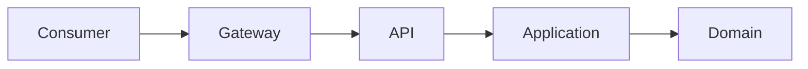

# REST Governance

# Purpose

Define governance for REST APIs with resource-oriented design, consistency, compatibility, security, observability, and operational reliability.

# When To Use This Technology

Use REST for most product APIs, SaaS backends, CRUD workflows, BFF-to-service communication, and integrations where resource contracts are stable and broadly understood.

# When NOT To Use This Technology

Avoid REST when the interaction is streaming, high-frequency bidirectional, strongly typed service-to-service RPC, or requires flexible graph-shaped client queries that justify GraphQL.

# Recommended Architecture Patterns

| Pattern | Use When | Trade-Off |
| --- | --- | --- |
| Resource APIs | Entities and workflows map to resources. | Requires naming discipline. |
| Command sub-resources | Business actions do not map cleanly to CRUD. | Can become RPC if overused. |
| BFF REST APIs | UI-specific aggregation is needed. | BFF must not own domain logic. |
| Versioned public APIs | External consumers depend on compatibility. | Adds lifecycle overhead. |



# Project Structure Guidance

- Keep API contracts close to controllers/handlers but separate from domain models.
- Store OpenAPI or equivalent specs where consumers can review them.
- Keep error schemas and pagination conventions shared.

# Code Organization Standards

- Use consistent naming, status codes, and error shapes.
- Keep handlers thin.
- Use explicit DTOs.
- Do not leak persistence models.

# API / Integration Guidance

- Use nouns for resources.
- Define pagination, filtering, sorting, and sparse field behavior consistently.
- Define idempotency for create or command endpoints that may retry.
- Version breaking changes.

# State Management Guidance

- Make resource state transitions explicit.
- Avoid ambiguous partial updates.
- Use optimistic concurrency where lost updates matter.

# Error Handling Standards

- Return consistent machine-readable error codes.
- Separate validation, auth, conflict, not found, and dependency errors.
- Include correlation IDs.

# Security Guidance

- Authenticate every protected endpoint.
- Authorize by resource and action.
- Validate input.
- Avoid exposing internal IDs or sensitive fields unless intentional.

# Testing Expectations

- Contract test request, response, and error schemas.
- Integration test authorization and validation.
- Regression test compatibility-sensitive endpoints.
- Smoke test critical APIs after deployment.

# Observability Expectations

- Track endpoint latency, status codes, error codes, and dependency failures.
- Log request IDs and user/tenant context safely.
- Trace cross-service calls.

# Performance Guidance

- Use pagination for collections.
- Avoid unbounded filtering and payloads.
- Cache read-heavy safe responses where appropriate.
- Monitor slow endpoints and query behavior.

# Scalability Guidance

- Keep APIs stateless.
- Use async workflows for long-running commands.
- Design idempotent writes where retries are likely.
- Avoid chatty API designs for high-latency clients.

# Deployment & Operational Guidance

- Publish contract changes before consumers rely on them.
- Use backward-compatible rollout where possible.
- Track API errors after deploy.

# Code Review Checklist

- [ ] Resource naming is consistent.
- [ ] Request and response schemas are explicit.
- [ ] Error contract is consistent.
- [ ] Auth and authorization are enforced.
- [ ] Pagination and filtering are bounded.
- [ ] Contract tests exist for important APIs.

# Common Anti-Patterns

- RPC-style REST.
- Inconsistent naming.
- Leaking DB schema.
- Unversioned breaking changes.
- Inconsistent error handling.

# AI Coding Assistant Guardrails

- Do not invent endpoint conventions inconsistent with the project.
- Generate DTOs and validation with endpoints.
- Include tests for errors and authorization.
- Do not expose persistence entities.

# Recommended Use Cases

- Product APIs.
- SaaS dashboards.
- Internal service APIs.
- External integrations with stable contracts.

# Example Architecture Patterns

```text
GET /customers?limit=50&cursor=...
POST /customers
GET /customers/{customerId}
PATCH /customers/{customerId}
POST /invoices/{invoiceId}/approve
```

