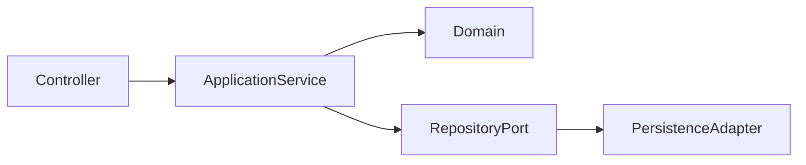

# Java Governance

# Purpose

Define governance for Java backend systems, especially enterprise services built with the Spring ecosystem. The guide favors modularity, explicit boundaries, operational readiness, and maintainable domain design.

# When To Use This Technology

Use Java for long-lived enterprise backends, transaction-heavy workflows, high maintainability needs, strong typing, mature ecosystem requirements, and teams with JVM operational capability.

# When NOT To Use This Technology

Avoid Java when a lightweight script, small automation, or low-latency single-purpose binary would be better served by simpler runtime choices.

# Recommended Architecture Patterns

| Pattern | Use When | Governance Concern |
| --- | --- | --- |
| Modular monolith | MVP or medium-scale domain with cohesive deployment. | Enforce module boundaries. |
| Layered architecture | CRUD and workflow services need clear separation. | Prevent business logic in controllers. |
| Hexagonal boundaries | Integrations and persistence must be isolated. | Avoid abstraction excess. |
| Microservices | Independent deployment and ownership are proven. | Avoid distributed monoliths. |



# Project Structure Guidance

- Organize by domain module before technical layer when domain complexity is meaningful.
- Keep controllers, application services, domain, persistence, and integration adapters separate.
- Keep shared libraries small and stable.
- Avoid package structures that encourage cross-domain imports.

# Code Organization Standards

- Keep controllers thin.
- Keep transaction boundaries explicit.
- Keep domain rules outside persistence entities where complexity requires it.
- Use framework annotations deliberately.
- Avoid generic service layers that hide business meaning.

# API / Integration Guidance

- Define stable request, response, and error contracts.
- Use DTOs at API boundaries.
- Avoid exposing ORM entities.
- Define idempotency for commands that may retry.

# State Management Guidance

- Treat database state ownership as part of module design.
- Avoid shared database access across independently owned services.
- Keep cache invalidation rules explicit.

# Error Handling Standards

- Map domain errors to consistent API errors.
- Do not leak stack traces or framework internals.
- Preserve root causes in logs with correlation IDs.

# Security Guidance

- Enforce authorization in backend application boundaries.
- Validate input and output data exposure.
- Use least-privilege database and service credentials.
- Audit sensitive operations.

# Testing Expectations

- Unit test domain logic.
- Integration test persistence and transaction behavior.
- Contract test public APIs.
- Smoke test application startup and health endpoints.

# Observability Expectations

- Include structured logs, metrics, traces, and health checks.
- Track latency, error rate, dependency failures, and database behavior.
- Make transaction and async failures observable.

# Performance Guidance

- Review ORM query behavior and N+1 risks.
- Bound thread pools and connection pools.
- Measure memory, GC, and startup behavior for production workloads.

# Scalability Guidance

- Scale modular monoliths vertically and operationally before extracting services.
- Extract services only around stable domain and ownership boundaries.
- Use async processing for long-running work with idempotency.

# Deployment & Operational Guidance

- Externalize config and secrets.
- Validate migrations before deployment.
- Provide health, readiness, and liveness endpoints where appropriate.
- Document rollback and forward-fix paths.

## Code Review Checklist

- [ ] Controller, application service, domain, repository, adapter, and integration boundaries are clear.
- [ ] Java/Spring idioms are used intentionally without hiding critical behavior behind framework magic.
- [ ] Transactions are explicit, correctly scoped, and do not leak across remote calls or unrelated domain operations.
- [ ] API DTOs do not expose JPA entities or persistence internals.
- [ ] Security checks are enforced at backend boundaries and include method/resource authorization where needed.
- [ ] Error handling maps domain, validation, authorization, conflict, and dependency errors consistently.
- [ ] Tests cover domain logic, transactions, persistence behavior, API contracts, and failure paths.
- [ ] Performance risks are checked: N+1 queries, lazy loading surprises, connection pool pressure, and inefficient batch work.
- [ ] Observability includes structured logs, metrics, traces, and correlation IDs for critical flows.
- [ ] Maintainability is protected from god services, excessive abstraction, and anemic domain drift.
- [ ] AI-generated code is checked for fake Spring APIs, unsafe annotations, missing tests, and DTO/entity leakage.

## Code Review Red Flags

- Transactional leaks across network calls or broad service methods.
- God services coordinating unrelated domains.
- Repository abuse with business logic in persistence queries.
- DTO/entity leakage across API boundaries.
- Hidden framework magic controlling security, transactions, or data loading.
- Anemic domain models with rules scattered across services.
- Shared database access across independently owned services.
- Missing integration tests for transaction or persistence behavior.

## AI Coding Assistant Review Guardrails

AI-generated Java code must be reviewed for hallucinated Spring APIs, fake annotations, inconsistent package conventions, over-abstraction, missing tests, missing transaction/error handling, insecure defaults, DTO/entity leakage, and architectural drift across domain modules.

# Common Anti-Patterns

- Distributed monoliths.
- Shared DB access.
- God services.
- Over-abstraction.
- Excessive framework magic.
- Anemic domain models.

# AI Coding Assistant Guardrails

- Follow existing package and Spring conventions.
- Do not create generic abstractions without repeated need.
- Add tests for transaction and error behavior.
- Do not expose JPA entities through APIs.

# Recommended Use Cases

- ERP and enterprise workflow systems.
- Transactional backends.
- Regulated business applications.
- Long-lived service platforms.

# Example Architecture Patterns

```text
src/main/java/com/company/app/
  sales/
    api/
    application/
    domain/
    persistence/
    integration/
  shared/
    security/
    observability/
```
