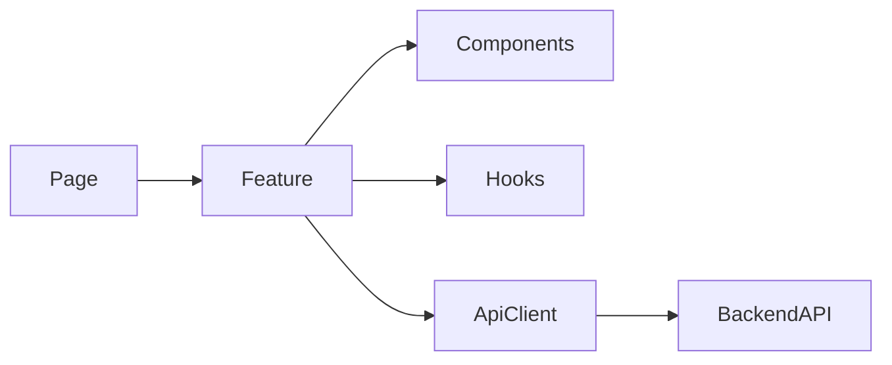

# React Governance

# Purpose

Define governance for React and React + TypeScript applications, especially SaaS dashboards, enterprise frontends, and AI-assisted frontend development.

# When To Use This Technology

Use React when the product needs component-driven UI, rich client interactions, strong ecosystem support, and flexible composition.

# When NOT To Use This Technology

Avoid React when a mostly static site, server-rendered content application, or low-interactivity workflow can be delivered with simpler tooling. Avoid React microfrontends unless team ownership, independent deployment, and platform governance justify the complexity.

# Recommended Architecture Patterns

| Pattern | Use When | Trade-Off |
| --- | --- | --- |
| Feature modules | Product areas have clear ownership. | Requires disciplined boundaries. |
| Container/presenter split | UI needs clear data and view separation. | Can become ceremony for small components. |
| Server state library | Remote data dominates UI behavior. | Requires cache invalidation discipline. |
| Design system integration | Multiple teams ship consistent UI. | Requires governance and versioning. |



# Project Structure Guidance

- Organize by feature for product surfaces.
- Keep shared UI primitives separate from domain-specific components.
- Keep API clients, DTOs, and mappers out of presentational components.
- Keep route definitions explicit and reviewable.

# Code Organization Standards

- Use TypeScript strict mode.
- Keep components small enough to reason about.
- Keep business rules in domain/application utilities, not JSX.
- Use custom hooks for cohesive behavior, not as a dumping ground.
- Avoid excessive context and global state.

# API / Integration Guidance

- Use typed API clients.
- Map API DTOs to view models when backend contracts do not match UI needs.
- Handle loading, empty, error, permission, and stale-data states.
- Do not couple UI to database-shaped responses.

# State Management Guidance

- Prefer local state for local UI concerns.
- Prefer server-state tooling for fetched data.
- Use global state only for genuinely shared client state.
- Avoid giant global stores and prop drilling everywhere.

# Error Handling Standards

- Show actionable user-facing errors.
- Preserve technical diagnostics in logs or monitoring.
- Treat failed permissions differently from failed availability.

# Security Guidance

- Do not store secrets in frontend code.
- Treat frontend authorization checks as UX controls, not security boundaries.
- Sanitize rendered rich content.
- Review token storage, session expiry, and sensitive data exposure.

# Testing Expectations

- Unit test domain utilities and complex hooks.
- Component test critical states.
- E2E test only critical workflows.
- Add accessibility checks for important flows.

# Observability Expectations

- Capture frontend errors, route failures, and key interaction failures.
- Track important page performance and API failure rates.
- Include correlation IDs where backend supports them.

# Performance Guidance

- Avoid unnecessary rerenders from unstable props and broad context updates.
- Use memoization intentionally, not by default.
- Split routes and heavy components.
- Measure before optimizing.

# Scalability Guidance

- Scale by feature ownership and design system discipline before microfrontends.
- Introduce microfrontends only with clear deployment and ownership needs.
- Keep shared dependencies versioned and governed.

# Deployment & Operational Guidance

- Use environment-specific config safely.
- Validate build-time and runtime variables.
- Include smoke checks for core routes after deploy.

## Code Review Checklist

- [ ] Feature, route, component, hook, API client, and view-model boundaries are clear.
- [ ] React idioms are followed: stable keys, controlled effects, predictable render flow, and no state mutation.
- [ ] Business logic is not buried in JSX or presentational components.
- [ ] State ownership is appropriate: local UI state, server state, and shared client state are separated.
- [ ] API integration handles loading, empty, error, permission, retry, and stale-data states.
- [ ] Security-sensitive behavior is enforced on the backend, not only in the UI.
- [ ] Accessibility is reviewed for forms, keyboard flow, focus, labels, dialogs, and error messages.
- [ ] Tests cover critical component states, hooks, API integration behavior, and user flows.
- [ ] Performance risks are checked: excessive rerendering, broad context updates, expensive effects, and large bundles.
- [ ] Observability exists for frontend errors and important failed user interactions.
- [ ] Maintainability is preserved through small components, clear naming, and limited custom hooks.
- [ ] AI-generated code is checked for fake APIs, inconsistent project patterns, missing states, and over-abstracted hooks.

## Code Review Red Flags

- Unstable list keys or index keys for mutable collections.
- Effect misuse, missing dependencies, or effects used for derivable state.
- Excessive rerendering from broad context, unstable callbacks, or object props.
- Business logic in components instead of domain/application utilities.
- Inaccessible UI states, dialogs, controls, or form errors.
- Giant global stores or context used as a general-purpose state container.
- API responses rendered directly without mapping or error handling.
- Custom hooks that hide side effects, permissions, or network behavior.

## AI Coding Assistant Review Guardrails

AI-generated React code must be reviewed for hallucinated component APIs, fake library methods, inconsistent design-system usage, over-abstraction, missing loading/error/empty states, missing tests, missing accessibility behavior, insecure client-side authorization assumptions, and architectural drift from feature boundaries.

# Common Anti-Patterns

- Giant global stores.
- Overusing context.
- Prop drilling everywhere.
- Business logic in UI.
- Premature microfrontends.
- Excessive custom hooks.
- Frontend/backend tight coupling.

# AI Coding Assistant Guardrails

- Inspect existing component, routing, state, and API patterns first.
- Generate small feature slices with tests.
- Do not introduce a global state library without justification.
- Do not invent backend contracts.
- Report changed files and assumptions.

# Recommended Use Cases

- SaaS dashboards.
- Admin consoles.
- Enterprise workflow applications.
- Rich internal tools.

# Example Architecture Patterns

```text
src/
  app/
  features/
    orders/
      components/
      hooks/
      api/
      model/
      routes.tsx
  shared/
    ui/
    api/
    config/
```
