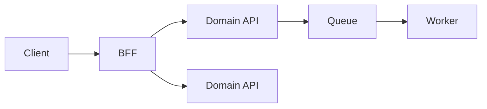

# Middleware Governance

# Purpose

Define governance for middleware, integration layers, BFFs, workflow orchestration, API orchestration, queues, and event-driven coordination.

# When To Use This Technology

Use middleware when systems need integration, orchestration, protocol translation, workflow coordination, async processing, or frontend-specific aggregation that does not belong inside core domain services.

# When NOT To Use This Technology

Avoid middleware when it becomes the owner of core business logic, hides dependencies, or replaces proper domain boundaries with central orchestration.

# Recommended Architecture Patterns

| Pattern | Use When | Risk |
| --- | --- | --- |
| BFF | UI needs aggregation or adaptation. | Business logic drifts into BFF. |
| Workflow orchestrator | Long-running multi-step process needs state. | Hidden coupling. |
| Event consumer | Async side effects are required. | Retry storms and ordering issues. |
| API gateway | Cross-cutting routing and policy are needed. | Gateway bloat. |



# Project Structure Guidance

- Separate orchestration, adapters, contracts, and policies.
- Keep domain decisions in domain services.
- Keep workflow state explicit and durable.
- Keep queues and topics owned and documented.

# Code Organization Standards

- Make dependency calls explicit.
- Keep retries, timeouts, and circuit breakers configurable.
- Avoid hidden mutable shared state.
- Keep transformations traceable.

# API / Integration Guidance

- Define contracts for every upstream and downstream system.
- Include idempotency keys for retried commands.
- Use dead-letter queues for unrecoverable async failures.
- Document ownership and support paths for each integration.

# State Management Guidance

- Use durable state for workflows.
- Avoid process-memory coordination for critical flows.
- Track correlation IDs across calls and events.

# Error Handling Standards

- Distinguish transient, permanent, validation, and dependency failures.
- Avoid retrying non-retryable errors.
- Use dead-letter handling and replay procedures.

# Security Guidance

- Enforce least privilege between systems.
- Avoid middleware becoming an unrestricted data broker.
- Audit sensitive transformations and routing decisions.
- Protect credentials for every integration.

# Testing Expectations

- Contract test integrations.
- Integration test retry and timeout behavior.
- Test idempotency and duplicate message handling.
- Smoke test critical orchestration paths.

# Observability Expectations

- Use distributed tracing across middleware boundaries.
- Track queue depth, retry counts, dead-letter counts, dependency latency, and workflow failures.
- Log correlation IDs consistently.

# Performance Guidance

- Avoid synchronous dependency chains across many systems.
- Bound retries and concurrency.
- Use backpressure for queues.
- Monitor payload sizes and transformation cost.

# Scalability Guidance

- Scale workers horizontally with idempotent processing.
- Partition queues or topics intentionally.
- Avoid central middleware bottlenecks.
- Keep orchestration ownership clear as workflows grow.

# Deployment & Operational Guidance

- Deploy middleware with compatibility checks.
- Document replay, dead-letter, and rollback procedures.
- Include runbooks for dependency outages.
- Monitor integration health after release.

# Code Review Checklist

- [ ] Middleware does not own core business logic.
- [ ] Contracts are explicit.
- [ ] Timeouts, retries, and idempotency are defined.
- [ ] Dead-letter handling exists where queues are used.
- [ ] Distributed tracing is present.
- [ ] Failure modes and runbooks are documented.

# Common Anti-Patterns

- Middleware becoming business monolith.
- Hidden orchestration logic.
- Synchronous dependency chains.
- Retry storms.
- Shared mutable state.
- No dead-letter handling.

# AI Coding Assistant Guardrails

- Do not add retries without idempotency analysis.
- Do not move domain rules into middleware.
- Include observability and failure handling with integration code.
- Ask for contracts before generating adapters.

# Recommended Use Cases

- System integration.
- BFF orchestration.
- Async workflows.
- Event consumers and workers.
- API policy enforcement.

# Example Architecture Patterns

```text
middleware/
  workflows/
  adapters/
  contracts/
  queues/
  observability/
  runbooks/
```

