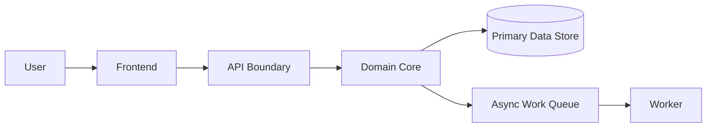

# HLD Template

## Purpose

Provide a reusable structure for high-level architecture documents that explain system shape, boundaries, responsibilities, constraints, and trade-offs before detailed implementation.

## Recommended Sections

1. Executive summary.
2. Goals and non-goals.
3. Context and assumptions.
4. MVP architecture.
5. Scale-stage architecture.
6. System context diagram.
7. Component responsibilities.
8. Data and integration flows.
9. Security, privacy, and compliance considerations.
10. Observability and operations.
11. Risks, alternatives, and trade-offs.
12. Open questions.
13. ADR links.

## Practical Guidance

- Keep implementation details out unless they affect architecture choices.
- Show ownership boundaries and integration contracts.
- State what is intentionally deferred.
- Add diagrams that explain flows, not decorative diagrams.

## Example Diagram

## Anti-Patterns

- Treating this document as a technology mandate instead of a decision aid.
- Copying examples without validating domain, team, scale, and operating constraints.
- Skipping explicit trade-offs because one option feels familiar.
- Optimizing for theoretical scale before proving product and usage patterns.

## Review Questions

- Does this guidance favor the simplest architecture that can satisfy current constraints?
- Are MVP and scale-stage choices separated clearly?
- Are trade-offs, risks, and alternatives explicit?
- Can a human reviewer and an AI agent apply this guidance without project-specific assumptions?
- Are security, operability, cost, and maintainability considered before novelty?
