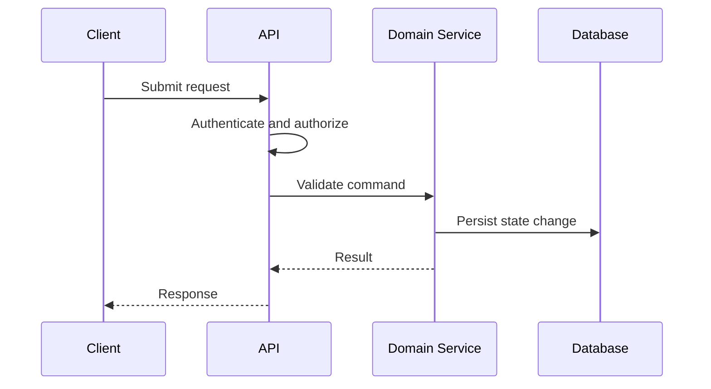

# LLD Template

## Purpose

Provide a reusable structure for implementation-level design covering APIs, data models, validations, sequence flows, invariants, errors, and test strategy.

## Recommended Sections

- Scope and linked HLD.
- Module/class/component design.
- API contracts.
- Data model and migrations.
- Sequence diagrams.
- Validation and invariants.
- Error handling and retries.
- Security checks.
- Observability hooks.
- Test plan.
- Rollout and rollback.

## Practical Guidance

- Write contracts precisely enough for parallel implementation.
- Define idempotency, pagination, authorization, and error semantics explicitly.
- Keep diagrams close to the code paths they explain.

## Example Sequence

## Anti-Patterns

- Treating this document as a technology mandate instead of a decision aid.
- Copying examples without validating domain, team, scale, and operating constraints.
- Skipping explicit trade-offs because one option feels familiar.
- Optimizing for theoretical scale before proving product and usage patterns.

## Review Questions

- Does this guidance favor the simplest architecture that can satisfy current constraints?
- Are MVP and scale-stage choices separated clearly?
- Are trade-offs, risks, and alternatives explicit?
- Can a human reviewer and an AI agent apply this guidance without project-specific assumptions?
- Are security, operability, cost, and maintainability considered before novelty?
